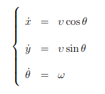
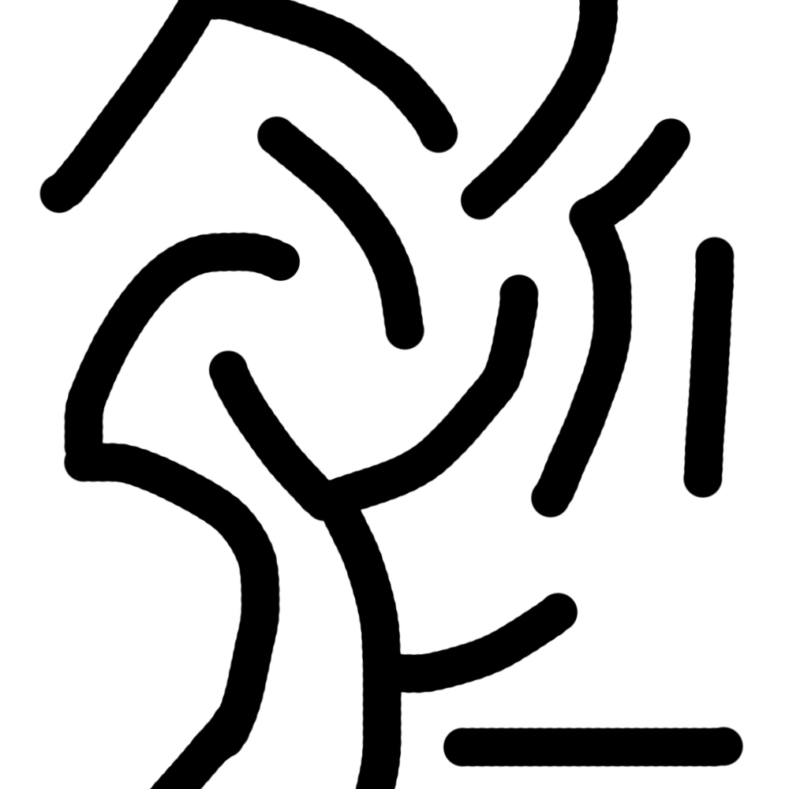
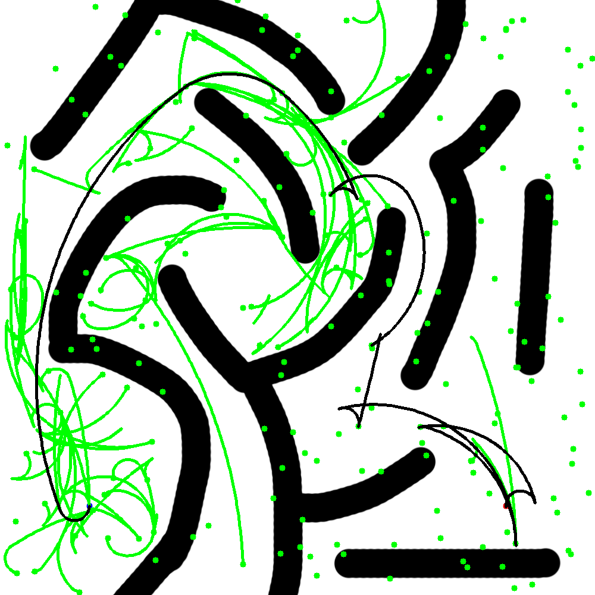

# car_RRT_path_planning

dependencies:

sudo apt-get install libopencv-dev

kdTree was implemented for efficiency by darkthecross.

The basic implementation was finished based on kdTree by darkthecross.

Then consider a car which can only turn left with the dynamic model:

First, we would want to have a local planner which could give us a feasible solution for simple situations.
It is not hard to derive a method to plan a path using the series of circles which lies to the left of the initial and terminal states. Just find the tangent circles, since we do not really need to guarantee to find a solution or find the optimal solution.

Then we can build a RRT algorithm based on this local planner. However, since it is hard to find the closest path from the current tree to a new node, we do not record all the extended states on the tree, instead, we record only the target points to speed up the result.

It works!

